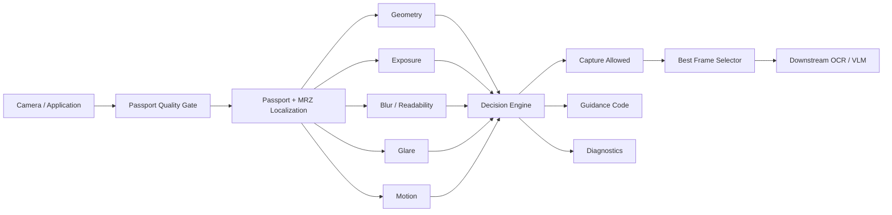

# Passport Quality Gate

**Pre-OCR passport capture quality assessment and real-time capture guidance.**


`passport_quality_gate` is a Python reference SDK for determining whether a passport camera frame is suitable for downstream OCR.

Instead of sending every captured image directly to OCR, the SDK analyzes the frame first and returns machine-readable capture decisions and guidance such as:

```text
READY
MOVE_CLOSER
MOVE_FARTHER
MOVE_LEFT
MOVE_RIGHT
MOVE_UP
MOVE_DOWN
HOLD_STEADY
RETAKE
```

The current SDK release is **v0.1.2**, built around the frozen quality policy:

```text
FP2-GOLDEN-ACTUAL
```

> This project is an integration/reference candidate. It does not claim document authenticity verification, guaranteed OCR correctness, or production validation across all devices and passport types.

---

## Why this exists

Even a strong OCR or vision-language model can fail unnecessarily when the captured passport image has poor acquisition quality.

Typical problems include:

- passport too far from the camera
- document partially outside the image
- poor positioning
- camera motion
- blur
- poor exposure
- glare or reflections
- weak text detail
- MRZ localization problems

This SDK sits **before OCR** and attempts to detect these conditions while the user can still correct them.

```text
Camera
   │
   ▼
Passport Quality Gate
   │
   ├── NOT READY ──> guidance back to user
   │
   └── READY
          │
          ▼
   Best recent frame
          │
          ▼
       OCR / VLM
```

---

## Architecture



The SDK does **not** own:

- camera acquisition
- mobile UI
- localized UI strings
- shutter control
- networking
- permanent image storage
- OCR

Those remain responsibilities of the consuming application.

---

## Main capabilities

| Capability | Description |
|---|---|
| Passport localization | YOLO-based passport page and MRZ localization |
| Geometry analysis | Position, scale, frame containment, crop risk and orientation evidence |
| Exposure analysis | Detects excessively dark or bright capture conditions |
| Blur metrics | Passport and MRZ sharpness analysis |
| Readability evidence | Estimates preservation of text detail |
| Glare analysis | Local highlight and texture-based reflection analysis |
| Motion analysis | Uses temporal information during live preview |
| Decision engine | Separates capture blockers from advisory guidance |
| Temporal preview | Stabilizes live capture decisions across frames |
| Best-frame selection | Maintains a recent in-memory candidate buffer for shutter-time selection |
| CPU / CUDA selection | `device="auto"` selects CUDA when available, otherwise CPU |
| Packaged assets | Detector weights and default configuration are included in the SDK package |

---

## Quick start

### Clone

```bash
git clone https://github.com/minhphi2508/passport_quality_gate.git
cd passport_quality_gate
```

### Create an environment

Windows / Git Bash:

```bash
py -3.12 -m venv .venv
source .venv/Scripts/activate

python -m pip install --upgrade pip
pip install -e ".[dev]"
```

For a GPU deployment, install the appropriate PyTorch/CUDA build for the target machine before installing the SDK.

---

## Verify the repository

The approved quality-policy core is protected by SHA-256 fingerprints.

Run:

```bash
python tools/verify_golden_core.py
```

Expected:

```text
Golden core OK: 13 files match FP2-GOLDEN-ACTUAL
```

Then run:

```bash
python -m pytest -q
```

---

## Basic API

```python
from passport_quality_gate.api import PassportQualityGate

gate = PassportQualityGate(device="auto")

guide_box = (0.16, 0.18, 0.68, 0.64)

result = gate.analyze_preview_public(
    frame,
    guide_box=guide_box,
)

print(result)
```

`guide_box` uses normalized:

```text
(x, y, width, height)
```

coordinates in the range `0–1`.

Example:

```python
(0.16, 0.18, 0.68, 0.64)
```

---

## Public result

The compact public API intentionally exposes a small integration contract:

```python
{
    "capture_allowed": False,
    "capture_quality_state": "NOT_READY",
    "workflow_state": "ALIGNING",
    "guidance_code": "MOVE_CLOSER",
    "recommended_adjustment": {...},
    "blocking_issues": [...],
    "advisories": [...],
    "timing_ms": {
        "total": 85.2
    }
}
```

Applications should primarily integrate against these fields rather than the full research-diagnostics dictionary.

See:

[`docs/API_CONTRACT.md`](docs/API_CONTRACT.md)

---

## Preview analysis

Live preview analysis is stateful:

```python
result = gate.analyze_preview_public(
    frame,
    guide_box=guide_box,
)
```

One `PassportQualityGate` instance should correspond to one capture stream/session.

When starting a new document or capture session:

```python
gate.reset()
```

---

## Final-frame analysis

For a full camera frame:

```python
result = gate.analyze_final_public(
    frame,
    guide_box=guide_box,
)
```

Final mode does not use preview temporal smoothing as the authoritative capture decision.

---

## Already-cropped passport images

If the input has already been cropped to the passport data page:

```python
result = gate.analyze_document_crop_public(
    cropped_page,
)
```

A UI guide box is not required in this mode.

---

## Best recent frame selection

The exact frame captured when the user presses the shutter can be degraded by finger or device motion.

The SDK therefore provides an optional rolling best-frame selector.

```python
from passport_quality_gate.frame_selector import BestFrameSelector

selector = BestFrameSelector()

selector.push(
    frame,
    result,
    timestamp=t,
)

best = selector.select_recent(
    trigger_timestamp=click_t,
)
```

The selector:

- keeps frames only in RAM
- uses a bounded rolling buffer
- considers recent capture-quality evidence
- avoids selecting arbitrarily old frames
- does not write images to disk

The default recent-frame window is approximately `750 ms` and is configurable.

See:

[`docs/BEST_FRAME_SELECTION.md`](docs/BEST_FRAME_SELECTION.md)

---

## Runtime information

```python
gate = PassportQualityGate(device="auto")

print(gate.runtime_info())
```

Example:

```python
{
    "sdk_candidate_version": "0.1.2",
    "quality_policy": "FP2-GOLDEN-ACTUAL",
    "device": "cpu",
    "production_validated": False
}
```

---

## Examples

Analyze an image:

```bash
python examples/analyze_image.py image.jpg --device auto
```

Check runtime configuration:

```bash
python examples/runtime_check.py
```

Run the reference webcam integration:

```bash
python examples/webcam_demo.py --source 1 --device auto
```

The webcam example is only an integration harness.

Camera resolution, device backend and UI behavior are **not SDK requirements**.

---

## Repository structure

```text
passport_quality_gate/
│
├── src/
│   └── passport_quality_gate/
│       ├── api.py
│       ├── analyzer.py
│       ├── localization.py
│       ├── geometry.py
│       ├── quality.py
│       ├── readability.py
│       ├── motion.py
│       ├── decision.py
│       ├── frame_selector.py
│       └── assets/
│
├── configs/
├── models/
├── examples/
├── tests/
├── tools/
├── docs/
├── scripts/
│
├── GOLDEN_CORE_SHA256.json
├── pyproject.toml
├── VERSION
└── README.md
```

---

## Frozen Golden policy

The quality behavior currently used as the project baseline is:

```text
FP2-GOLDEN-ACTUAL
```

The corresponding algorithm/runtime core is fingerprinted in:

```text
GOLDEN_CORE_SHA256.json
```

The goal is to allow packaging, SDK APIs, examples and integration infrastructure to evolve without silently modifying the approved quality behavior.

Do **not** regenerate Golden hashes simply to make a failed verification disappear.

A hash mismatch should first be treated as an unexpected core modification.

---

## Development workflow

Stable baseline:

```text
main
└── v0.1.2
    └── FP2-GOLDEN-ACTUAL
```

For new development:

```bash
git checkout -b develop/v0.1.3
```

Recommended workflow:

```text
git clone
    ↓
create .venv
    ↓
pip install -e ".[dev]"
    ↓
verify Golden core
    ↓
run tests
    ↓
create development branch
    ↓
develop / test
    ↓
pull request
    ↓
main
```

---

## Known limitations

The current Golden policy intentionally preserves several known limitations instead of continuing uncontrolled threshold tuning.

Current limitations include:

- document completeness/corner evidence is imperfect in some capture conditions
- strong glare, particularly around OCR-critical areas, remains challenging
- severe camera movement may cause preview instability
- several quality thresholds have not yet been calibrated directly against downstream OCR success
- detector/corner reliability can degrade with extreme blur, rotation, cropping or perspective
- behavior and performance have not yet been validated across the full range of target mobile devices

See:

[`docs/KNOWN_LIMITATIONS.md`](docs/KNOWN_LIMITATIONS.md)

---

## Documentation

Detailed technical documentation is available under [`docs/`](docs/):

| Document | Purpose |
|---|---|
| [API Contract](docs/API_CONTRACT.md) | Stable SDK integration interface |
| [Integration Guide](docs/INTEGRATION_GUIDE.md) | How applications should integrate the SDK |
| [Installation](docs/INSTALLATION.md) | Environment and installation guidance |
| [Deployment](docs/DEPLOYMENT.md) | CPU/GPU and deployment considerations |
| [Best Frame Selection](docs/BEST_FRAME_SELECTION.md) | Rolling-buffer frame selection |
| [Output and Storage](docs/OUTPUT_AND_STORAGE.md) | Output and persistence behavior |
| [Known Limitations](docs/KNOWN_LIMITATIONS.md) | Current technical limitations |
| [Developer Handoff](docs/DEVELOPER_HANDOFF.md) | Integration responsibilities and boundaries |
| [Release Validation](docs/RELEASE_VALIDATION.md) | Release verification notes |

---

## Release status

| Item | Current state |
|---|---|
| SDK | `v0.1.2` |
| Quality policy | `FP2-GOLDEN-ACTUAL` |
| Golden core | Frozen and hash-verified |
| Wheel installation | Fresh-environment tested |
| Packaged model/config | Verified |
| Preview API | Verified |
| Final API | Verified |
| Best-frame utility | Verified |
| Current phase | Application integration / real-device evaluation |

The next development phase focuses on application integration and real capture evaluation rather than changing the frozen FP2 quality policy.